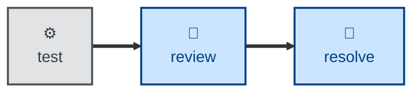

# Review

The **review** skill is all about evaluating code for style conventions and
pattern consistency.

The agent is instructed to statically analyzes the diff in an open pull request,
checking correctness, design, clarity, test coverage, security, and completeness.

Findings are specific and actionable, each carrying a severity (blocking,
suggestion, nitpick, praise) and organized along two axes:

- **Specification.** Does it faithfully implement the issue/ACs?
- **Standards.** Does it conform to the repo's conventions?

## Interactivity

This skill instructs the agent to run non-interactively.

## How to invoke

> Review this PR.

> Review my changes before I push.

> Check this diff against the spec and our conventions.

## Recommended models

A frontier reasoning model is best suited to this task.

## Suggested workflows

## Related skills

- **[resolve](../resolve/).** Actions the open comments this skill leaves.

- **[audit](../audit/).** A wider, design-level companion to this skill's
  PR-level pass.
