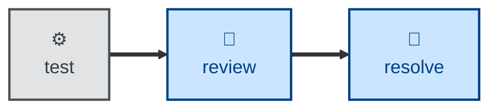

# Review

The **review** skill audits a proposed code change against the specification
it claims to satisfy and against the project's own standards.

The agent is instructed to analyze the diff statically — pinned to an explicit
comparison base and read in commit order — covering correctness, design,
clarity, test coverage, security, and completeness. It reports findings and
stops there: it makes no code or configuration changes of its own.

Findings are specific and actionable, each carrying a severity (blocking,
suggestion, nit, praise) and organized along two axes:

- **Specification.** Does the change faithfully implement the issue and its
  acceptance criteria?

- **Standards.** Does it conform to the project's documented conventions?

The review closes with a single verdict: approve, request changes, or comment.

## Interactivity

This skill instructs the agent to run non-interactively, so it suits
away-from-keyboard workflows such as continuous integration. The one
exception is location: where the session context and the environment do not
settle where the specification, the decision records, or the standards live,
the agent may ask. It never asks about the substance of the review.

## How to invoke

> Review this PR.

> Review my changes before I push.

> Check this diff against the spec and our conventions.

Name the comparison base if it is not obvious — for example, "review this
branch against `release/2.1`" — otherwise the agent pins one itself and states
which it used.

## Recommended models

A frontier reasoning model is best suited to this task. Judging whether an
implementation genuinely satisfies an acceptance criterion, and spotting the
edge case nobody wrote down, is open-ended analysis rather than a mechanical
transformation.

## Suggested workflows

Run this skill once the automated checks are green. Style, formatting, and
lint findings are cheaper to catch mechanically, and this skill is explicitly
told not to spend its attention there.

## Related skills

- [**resolve**](../resolve/) \
  Actions the open comments this skill leaves behind. Review reports and
  stops; resolve does the fixing.

- [**audit**](../audit/) \
  A wider, design-level companion to this skill's change-level pass. Reach
  for audit when the question is about the system rather than the diff.
