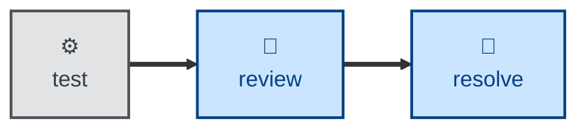

# Review

The **review** skill is all about evaluating code for style conventions and
pattern consistency. It statically analyzes the diff
in an open pull request, checking correctness, design, clarity, test coverage,
security, and completeness.

Findings are specific and actionable, each carrying a severity (blocking,
suggestion, nitpick, praise) and organized along two axes:

- **Specification:** does it faithfully implement the issue/ACs.
- **Standards:** does it conform to the repo's conventions.

It closes with an explicit verdict — approve, request changes, or comment. Use it
when auditing a coworker's branch, or self-reviewing changes before opening a PR.
The agent surfaces findings without fixing them; orchestrators may hand off to
**[resolve](../resolve/)** to action the open comments. For a wider architectural
review, see **[audit](../audit/)**.

This skill instructs the agent to run non-interactively.

## How to invoke

> Review this PR.

> Review my changes before I push.

> Check this diff against the spec and our conventions.

## Recommended models

Reviewing a change for correctness, design, security, and completeness is
judgment-heavy and adversarial by nature — you're looking for what the author
missed. Use a frontier reasoning model; mid-tier models tend to under-report
subtle defects and over-report style nitpicks.

## Suggested workflows

**review** runs once an increment builds and tests green, leaving comments for
**[resolve](../resolve/)** to action before integration. For a wider,
design-level pass, **[audit](../audit/)** is the companion.

## Related skills

- **[resolve](../resolve/):** actions the open comments this skill leaves.

- **[audit](../audit/):** the wider, design-level companion to this skill's
  PR-level pass.
