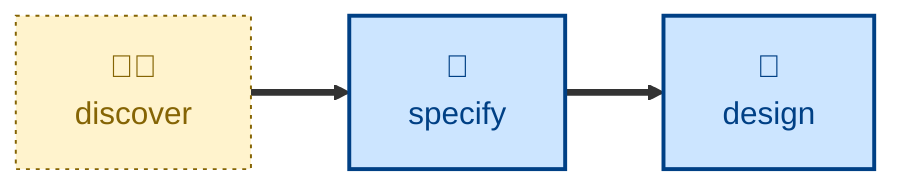

# Specify

The **specify** skill is all about specifying functional and non-functional
requirements as testable acceptance criteria. It transforms a business-oriented
product requirements document (PRD), or similar artifact, into executable
acceptance criteria.

The outcome is testable acceptance criteria, written in an executable form,
covering both functional behaviors and non-functional runtime qualities. Those
acceptance criteria may subsequently be used as a stable contract that agents
operate against in away-from-keyboard, specs-to-code agentic workflows.

The **[test](../test/)** skill instructs against to validate their progress
against the acceptance tests. Because the contract is executable, it means the
agents can use deterministic tools — and not rely on judgment — to decide
whether their work is done.

The acceptance criteria thus act as a fitness function that the agent can
iterate toward — a deterministic, stable signal of how close the current
implementation is to the desired outcome. This is acceptance test-driven
development (ATDD) applied to agentic workflows.

## Interactivity

This skill instructs the agent to run non-interactively.

## How to invoke

> Turn this into acceptance criteria.

> Turn this into a spec.

> Prepare these as software requirements.

## Recommended models

A mid-tier model is sufficient for this task. A frontier model helps with
softer, more contestable judgment calls.

## Suggested workflows

## Related skills

- **[discover](../discover/)** supplies the PRD this skill transforms into acceptance criteria.
- **[design](../design/)** builds against the acceptance criteria this skill produces.
