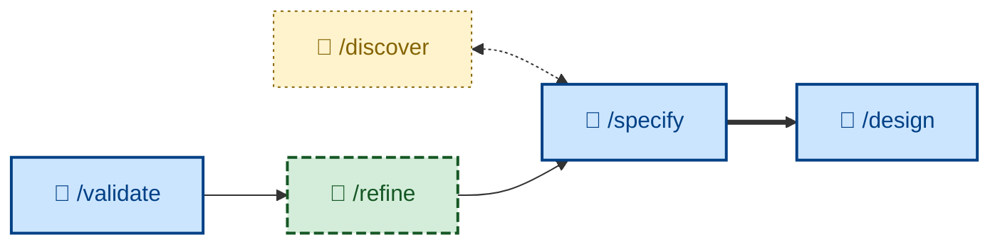

# 🤖 `/specify`

Transform a business-oriented product requirements document (PRD), or similar artifacts, into testable acceptance criteria.

The PRD may come from two sources: a business discovery workshop (`/discover`), or a product refinement workshop (`/refine`) that is run in response to feedback from real people using working software (`/validate`).

The outcome is a PR opened against the project's software requirements specification (SRS) repository, ready for the user to review. If approved, the (`/design`) skill can be triggered to propose solutions to realize the requirements.



The `/specify` skill runs non-interactively, supporting agentic workflows (🤖). It validates the inputted PRD and either rejects it as incomplete, or it autonomously completes the transformation to the SRS. If the business needs are vague, ambiguous, or unclear in any way, a discovery workshop (`/discover`) SHOULD be conducted beforehand, to produce a comprehensive PRD that becomes the input to `/specify`.

The `/specify` skill closes by returning the URL to the pull request, telling the user the PR needs their approval, and reminding that the next SDLC phase – `/design` – cannot begin until the PR is approved. Accepting (or rejecting) the proposed changes to the requirements specification is an important decision left to sapiens, not agents.

> [!IMPORTANT]
> This is a critical step in an agentic workflow.
>
> The outcome of the `/specify` step is testable acceptance criteria, written in an executable form, covering both functional behaviors and non-functional runtime qualities. Those acceptance criteria become a stable contract that agents subsequently operate against. Later in the workflow, in the `/test` phase, agents will validate their progress against the acceptance tests. Because the contract is executable, it means the agents can use deterministic tools – and not rely on judgement – to decide whether their work is done.
>
> The acceptance criteria act thus as a fitness function that the agent can iterate toward – a deterministic, stable signal of how close the current implementation is to the desired outcome. This is acceptance test-driven development (ATDD) applied to agentic workflows.
>
> The better the quality of the acceptance tests, the more effective they will be at driving agents to predictable, reliable outcomes, and so the less need there will be for humans-in-the-loop. In a fully end-to-end agentic workflow, humans need not read the generated code at all – in the same way we do not read a compiler's output – because the trust comes from the acceptance tests.
>
> We're now programming at a higher level of abstraction – our programming language is structured English, in the form of executable acceptance tests.

## Requirements

Agents following this skill will have the following expectations:

- The current project MUST have a file named `AGENTS.md` at the root. This file MUST have a section named "Workflow repositories" that specifies the location of the project's software requirements specification (SRS), which itself MUST be another repository on the local filesystem. Example:

  ```markdown
  ## Workflow repositories

  - SRS: ./docs/specs
  - RFC: ./docs/rfc
  - Design: ./docs/design
  - Plans: ./docs/plans
  ```

- The SRS repository MUST have its own root-level `AGENTS.md` file, which MUST specify the SRS's own workflow. This file MUST declare the availability of the following repository-level skills, which serve the following purposes:

  - `/draft-spec`: Scaffolds the specification artifacts.
  - `/write-spec`: Writes the requirements as verifiable acceptance criteria, based on the high-level requirements defined in the PRD.
  - `/propose-spec`: Opens a pull request, ready for the user to review the new artifacts.

> [!NOTE]
> Agents are explicitly instructed to follow `AGENTS.md` rather than `CONTRIBUTING.md`. This provides the flexibility of specifying different workflows for agents and sapiens.

This `/specify` skill instructs the agent to follow the guidelines in those named sub-skills that are expected to be defined in the SRS repository. The sub-skills are responsible for driving the software requirements workflow through to the point of a new or updated software requirement being proposed via an open pull request.

See the [**📋 Software Requirements Specification (SRS)**](https://github.com/kieranpotts/specs) repository for a reference implementation.

## How to invoke

* `/specify`, `/skill:specify` (prompt varies by agent harness).
* `/specify <URL or path to PRD or equivalent>`
* "Turn this into acceptance criteria."
* "Turn this into a spec."
* "Prepare these as software requirements."
