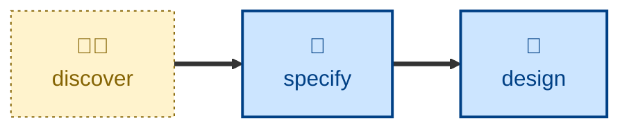

# Specify

The specify skill turns a business-oriented product requirements document
(PRD), or similar informal artifact, into a formal software requirements
specification written as testable acceptance criteria.

The agent is told to validate the PRD first, and to reject it with an itemized
list of gaps if it is too vague or incomplete to specify from — it never
invents the missing parts. Where the PRD passes, the agent discovers where the
project keeps its requirements, learns that store's own template, lifecycle,
and filing mechanics, then authors the specification and leaves it awaiting
the user's review. It stops there: approval and design are the user's call.

The outcome covers both functional behaviors and non-functional runtime
qualities. Those acceptance criteria can then serve as a stable contract that
agents operate against in away-from-keyboard, specs-to-code workflows —
a fitness function to iterate toward, giving a deterministic signal of how
close an implementation is to the desired outcome, rather than relying on
judgment. This is acceptance test-driven development (ATDD) applied to agentic
workflows.

## Interactivity

This skill instructs the agent to run non-interactively, so it suits
away-from-keyboard workflows. It never asks about the substance of the
requirements: an inadequate PRD is rejected rather than negotiated. Its one
permitted question is where the project's requirements live and how to file
into them, and only when the session context and environment do not settle
that.

## How to invoke

> Turn this into acceptance criteria.

> Turn this into a spec.

> Prepare these as software requirements.

## Recommended models

A mid-tier model is sufficient for this task. A frontier model helps with
softer, more contestable judgment calls — in particular deciding whether a
gap in the PRD is substantive enough to reject on.

## Suggested workflows

Run this after requirements have been gathered and written up, and before any
design or implementation work begins. It is not a per-commit or per-PR skill.

## Related skills

- [**discover**](../discover/) \
  Gathers the requirements and produces the PRD that this skill transforms
  into acceptance criteria.

- [**design**](../design/) \
  Runs after approval, designing an implementation against the acceptance
  criteria this skill produces.

- [**test**](../test/) \
  Validates progress against the acceptance criteria, letting agents use
  deterministic tools rather than judgment to decide whether work is done.
