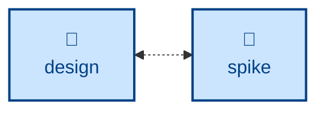

# Spike

The **spike** skill is all about developing throwaway code to answer design
questions. It treats the code as a byproduct and the *answer* as the
deliverable.

It frames one falsifiable question, defines up front the evidence that would
close it, and sets an enforced time-box. Then it takes the shortest path — no
tests, no error handling, no abstraction, hardcoded inputs — runs the experiment,
and records findings reproducible from the notes alone. It documents the answer
in the right artifact (ADR, design-doc update, spec revision, decision log) and
throws the code away.

Use it when a design question can't be answered by reasoning alone, or when a
specification is too speculative to commit to without evidence. It is a companion
to **[design](../design/)**, answering the open questions a design turns on.

This skill instructs the agent to run non-interactively. Negative answers are
captured with the same care as positive ones, and the code is never promoted —
the production version is re-implemented cleanly.

## How to invoke

> So a spike on whether X is feasible.

> Prototype this to answer the open question.

## Recommended models

A spike answers a specific feasibility or performance question with throwaway
code, so a mid-tier coding model is usually enough. Reach for a frontier
reasoning model when the open question itself is subtle (e.g. concurrency or API
ergonomics) and getting the experiment design wrong would waste the time-box.

## Suggested workflows

**spike** is a helper to **[design](../design/)**: when a decision turns on an
unknown, it runs a time-boxed experiment, records the finding in the right
artifact, and returns the answer to the design.
