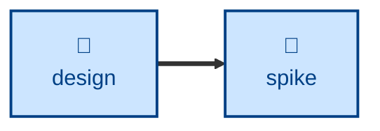

# Spike

The **spike** skill is all about developing throwaway code to answer design
questions.

Use this skill when a design question can't be answered by reasoning alone, or
when a specification is too speculative to commit to without evidence.

## Interactivity

This skill instructs the agent to run non-interactively.

## How to invoke

> Do a spike on whether X is feasible.

> Prototype this to answer the open question.

## Recommended models

A mid-tier coding model is sufficient for this task. Reach for a frontier
reasoning model when the open question itself is subtle.

## Suggested workflows

## Related skills

- **[design](../design/).** Companion skill that poses the questions a spike
  answers with throwaway code.
