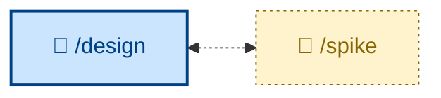

# 🤖 `/spike`

`/spike` = throwaway experimentation. It treats the code as a byproduct and the *answer* as the deliverable. It frames one falsifiable question, defines up front the evidence that would close it, and sets an enforced time-box. Then it takes the shortest path — no tests, no error handling, no abstraction, hardcoded inputs — runs the experiment, and records findings reproducible from the notes alone. It documents the answer in the right artifact (ADR, design-doc update, spec revision, decision log) and throws the code away.

Use it when a design question can't be answered by reasoning alone, or when a specification is too speculative to commit to without evidence. Give it one falsifiable question; it states the closing evidence and time-box, runs the experiment, captures the finding, and disposes of the code.

It runs non-interactively. Negative answers are captured with the same care as positive ones, and the code is never promoted — the production version is re-implemented cleanly (🤖).

This skill instructs the agent to run non-interactively (🤖).

## How to invoke

- `/spike`, `/skill:spike` (prompts vary by harness).
- `/spike can Postgres LISTEN/NOTIFY sustain 5000 dispatches/sec at p95 < 50ms?`
- "Spike on whether X is feasible."
- "Prototype this to answer the open question."
