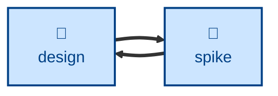

# Spike

The **spike** skill writes throwaway code to answer one falsifiable design
question, records the answer, and disposes of the code.

The agent is instructed to frame a single question — feasibility, performance,
API ergonomics, or integration risk — to define up front the evidence that
would close it, and to set a time-box before writing anything. It then takes
the shortest path to that evidence, skipping the tests, error handling, auth,
configuration, and abstraction that production code carries, and keeps the
experiment isolated from the production paths. The findings are filed in
whichever of the project's own stores owns that class of question, and the
spike code is then deleted or quarantined.

The agent stops at the answer. Resuming the design, revising the
specification, and re-implementing anything for production are left to the
caller.

## Interactivity

This skill instructs the agent to run non-interactively, so it suits
away-from-keyboard workflows. It does not prompt for answers about the
question or the experiment; where the question is not falsifiable, or the
budget is unbounded, it stops and says so rather than guessing. It will pause
only to have a human name the store where the answer should be filed, when
context and environment do not settle that.

## How to invoke

> Do a spike on whether X is feasible.

> Prototype this to answer the open question.

> Time-box an experiment on whether the new SDK surfaces streaming errors
> mid-stream.

You can name the time-box up front ("spend half a day on…") to fix the budget.
Otherwise the agent sets one proportionate to the question and states it before
starting.

## Recommended models

A mid-tier coding model is sufficient: the code is small, disposable, and
deliberately unpolished. Reach for a frontier reasoning model when the open
question itself is subtle, or when framing a falsifiable version of it is the
hard part.

## Suggested workflows

Best run when a design decision is blocked on evidence that reasoning cannot
supply, and closed as soon as that evidence exists. Running a spike as a way
to start building the real thing is an anti-pattern: the code carries none of
the discipline production work needs, and keeping it skips the specification
and design steps the spike was meant to inform.

## Related skills

- [**design**](../design/) \
  Companion skill that poses the questions a spike answers with throwaway
  code, and that consumes the answer once the spike has filed it.

- [**decide**](../decide/) \
  Records an architecturally significant decision. A spike's finding is often
  the evidence such a decision rests on.
