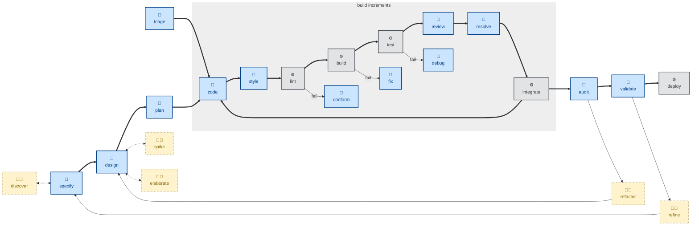

# 🤖 `style`

This skill focused on cleaning up code presentation.

It makes changes that are visually large but semantically empty. The agent is instructed to apply consistent use of whitespace, ordering, line wrapping, quotes, trailing commands, import order, and so on.

The rules can be applied to all kinds of text content — not only code, but technical documentation, requirements specifications, and so on.

Use this skill where conventional linting tools are unavailable for the target format.

This skill instructs the agent to run non-interactively (🤖).

## How to invoke

- `/style`, `/skill:style` (prompts vary by harness).
- "Format this file."
- "Fix the formatting / lint errors."
- "Tidy up the whitespace and style here."
