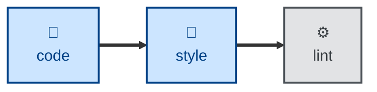

# Style

The **style** skill is all about improving the presentation of code and
content — whitespace, wrapping, quoting, ordering — without changing
structure, behavior, or meaning.

The agent is instructed to produce a diff that is visually large but
semantically empty. It first names exactly what will change in presentational
terms, refusing the job if it cannot. It then discovers the project's own
formatter and runs it as configured, holding the run to the narrowest scope
that covers the target files, and verifies afterwards that the tests still
pass. Formatter and lint configuration are left untouched, so the pass
demonstrably applies the existing rules rather than new ones, and generated
and vendored files are left to the tools that own them.

The rules apply to all kinds of text content — not only code, but technical
documentation, requirements specifications, and more. The skill is most useful
where conventional formatting tools are unavailable for the target format. It
stops once the change is filed as a single style-typed commit; reviewing and
integrating it are left to the caller.

## Interactivity

This skill instructs the agent to run non-interactively, so it suits
away-from-keyboard workflows, including continuous integration. The agent does
not prompt for answers to its questions. Where it cannot determine what to
format, it stops with an error message rather than guessing.

## How to invoke

> Format this file.

> Fix the formatting errors.

> Tidy up the whitespace and style here.

Name a file, a directory, or nothing at all — with no target given, the agent
formats what has changed in the working tree. Say how wide to go if you want
more than the narrowest scope.

## Recommended models

A small, fast model is sufficient. The work is a mechanical transformation
carried out mostly by the project's own formatter, and the judgment calls that
remain are narrow.

## Suggested workflows

Run this after a change is otherwise complete, so that formatting noise stays
out of the diff that carries the logic. Do not run it on the same commit as
feature or fix work, and do not run it repo-wide as a habit — a wide scope
makes for a diff nobody can review.

## Related skills

- [**proof**](../proof/) \
  Corrects the language of prose — spelling, grammar, wording — while this
  skill normalizes only its presentation. Run both on documentation, in either
  order, as separate changes.

- [**refactor**](../refactor/) \
  Takes over when a change would alter structure rather than presentation:
  renames, extractions, reordered parameters — all of which this skill
  refuses.

## References

- [TS-9: Version Control](https://kieranpotts.com/standards/009) \
  Defines the `style:` and `maintenance:` commit types used here.

- [TS-27: Markdown](https://kieranpotts.com/standards/027) \
  Formatting conventions for Markdown content.
