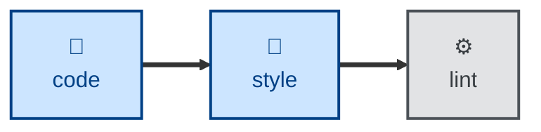

# Style

The **style** skill is all about improving code presentation — whitespace,
style, ordering — without changing structure. It makes
changes that are visually large but semantically empty: consistent whitespace,
ordering, line wrapping, quotes, trailing commas, import order, and so on.

The rules apply to all kinds of text content — not only code, but technical
documentation, requirements specifications, and more. Use it where conventional
linting tools are unavailable for the target format. Where **[proof](../proof/)**
corrects language, **style** normalizes presentation.

This skill instructs the agent to run non-interactively.

## How to invoke

> Format this file.

> Fix the formatting / lint errors.

> Tidy up the whitespace and style here.

## Recommended models

Pure formatting changes need no reasoning at all — a small, fast model is the
right choice, and an automated formatter is often better still.

## Suggested workflows

**style** runs immediately after **[code](../code/)** in the build-increments loop,
normalizing presentation before the scripted lint step checks it.
