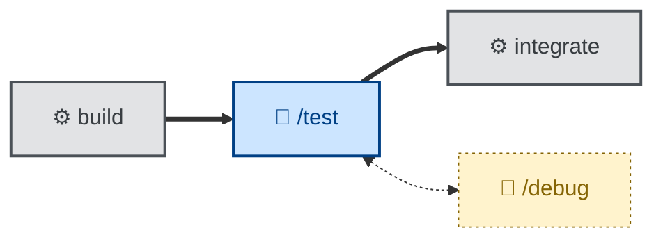

# 🤖 `test`

`test` = acceptance verification. It verifies the whole solution against the specification — it does not write fresh tests for new behavior (that's the implementation's job) or diagnose a failure (that's separate). It runs the automated suite, covers non-automatable ACs by hand with captured evidence, and verifies NFRs against their stated thresholds (recording the *measured number*, not just "ok"). The outcome is a verification report mapping every AC to a status (PASS / FAIL / BLOCKED / N/A) with evidence, and an explicit verdict.

Use it after a change has cleared review, or before tagging a release. It takes the completed change and its ACs; it pulls the criteria itself and stops to resolve them if they're vague. It reports failures as defects without fixing them.

It verifies against the agreed specification — whether the specification was right in the first place is [`validate`](../validate/)'s job.

It runs non-interactively, and tests **against the specification, not the implementation**. It classifies each failure as an implementation defect or a specification defect and reports it without fixing — and never silently weakens an AC, downgrades a BLOCKED to PASS, or retries a flaky test until green (🤖).

This skill instructs the agent to run non-interactively (🤖).

## How to invoke

- `/test`, `/skill:test` (prompts vary by harness).
- "Test this against the spec."
- "Verify this meets the acceptance criteria."
- "Run acceptance testing on this change."
