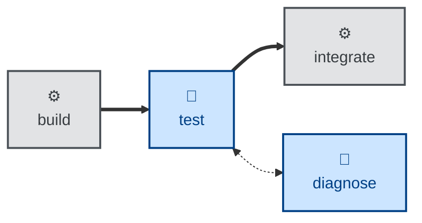

# Test

The test skill checks the evolving software for both functional correctness and
runtime qualities.

The agent is instructed to recover the full set of acceptance criteria from
wherever the project keeps its specification, run the automated suite tier by
tier, cover the non-automatable criteria by hand with captured evidence, and
measure every non-functional requirement against its stated threshold. It then
probes off-script within a time-box.

The output is a verification report mapping every acceptance criterion to a
status — PASS, FAIL, BLOCKED, or N/A — with a pointer to evidence, a record
of the environment the checks ran in, and one explicit verdict. Failures are
classified as implementation defects or specification defects and handed back.
The skill fixes neither, and does not release the change.

## Interactivity

This skill instructs the agent to run non-interactively, so it suits
away-from-keyboard workflows such as continuous integration. The one exception
is locating artifacts: the agent may ask where the specification lives, or how
to reach it, when the session context and the environment do not settle that
between them. It never asks about the substance of the testing itself — if it
cannot determine that, it stops with an error.

## How to invoke

> Test this against the spec.

> Verify this meets the acceptance criteria.

> Run acceptance testing on this change.

Mention a time-box ("give it an hour of exploratory testing") to adjust how long
the off-script pass runs. The default is 15-30 minutes of work for a typical
change, longer for high-risk areas.

## Recommended models

A mid-tier model is sufficient for running the suite and mapping criteria to
evidence, which is largely mechanical. Escalate to a frontier reasoning model
where the non-functional criteria carry real weight, or where the exploratory
pass matters — probing for what the specification failed to anticipate rewards
stronger reasoning.

## Suggested workflows

Run this after a change has cleared review, before it is integrated, and again
over the release candidate before a release. Running it on a change that has not
yet been reviewed wastes the run: static defects surface in review far more
cheaply.

## Related skills

- [**validate**](../validate/) \
  Asks whether the specification this skill verifies against was the right
  specification in the first place.

- [**diagnose**](../diagnose/) \
  Takes on the implementation defects this skill reports but deliberately
  leaves unfixed.
