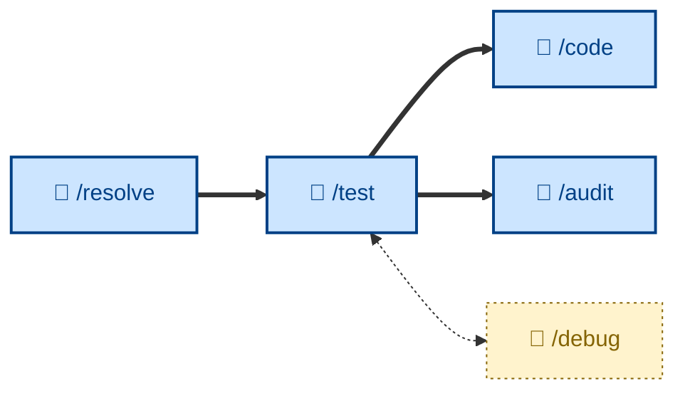

# 🤖 `/test`

<!-- "in the small" - tests an incremental step toward delivery of a larger feature. Evaluates against an agreed specification. Purpose of continuous acceptance testing is to keep development on-track. -->

<!-- Test = does the increment meet the agreed ACs? This is verification - against the spec as written. This is distinct from /validate, which asks the question: was the specification right in the first place? -->

<!-- This is acceptance test-driven development. This is an effective way of driving agentic software development. The outcome you want is deterministic and stable. It is the "truth". This is why it is so valuable in agentic workflows because all you really care about is the agent satisfying those tests. This becomes the contract the AI is operating against. ... The closer you get to achieving this, eg. covering performance tests with BDD-style tests too, the less need you have for a sapien-in-the-loop - as long as the actual outcome matches the desired outcome. -->

Conduct incremental acceptance testing of the evolving software, focusing on functional correctness and runtime qualities – verifying a completed change against its full set of acceptance criteria, mapping each to evidence and reporting pass/fail/blocked. Runs non-interactively (🤖). Use after a change has cleared review, or before tagging a release. Reports failures as defects without fixing them.

## What it does

`/test` verifies the whole solution against the specification – it does not write fresh tests for new behavior (that's the implementation's job) or diagnose a failure (that's separate). It runs the automated suite, covers non-automatable ACs by hand with captured evidence, and verifies NFRs against their stated thresholds (recording the *measured number*, not just "ok"). The outcome is a verification report mapping every AC to a status (PASS / FAIL / BLOCKED / N/A) with evidence, and an explicit verdict.

It is non-interactive and tests **against the specification, not the implementation**. It classifies each failure as an implementation defect or a specification defect and reports it without fixing – and never silently weakens an AC, downgrades a BLOCKED to PASS, or retries a flaky test until green.

## How to invoke

Invoke it after review clears, or before a release. It takes the completed change and its ACs; it pulls the criteria itself and stops to resolve them if they're vague.

- `/test`, `/skill:test` (prompt varies by agent harness).
- "Test this against the spec."
- "Verify this meets the acceptance criteria."
- "Run acceptance testing on this change."
