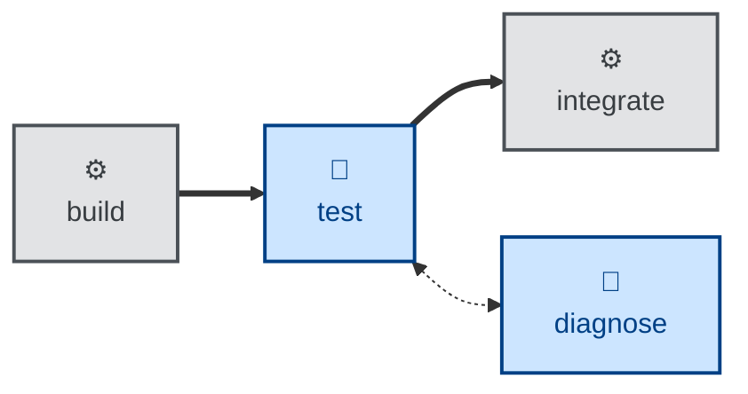

# Test

The **test** skill is all about checking the evolving software for both
functional correctness and runtime qualities.

The agent is instructed to verify the whole solution against the specification.
It runs the automated suite, and covers non-automatable ACs by hand with captured
evidence, and verifies NFRs against their stated thresholds.

The outcome is a verification report mapping every AC to a status, with evidence.

## Interactivity

This skill instructs the agent to run non-interactively.

## How to invoke

> Test this against the spec.

> Verify this meets the acceptance criteria.

> Run acceptance testing on this change.

## Recommended models

A mid-tier model is sufficient for this task. Escalate to a frontier reasoning
model for non-functional acceptance criteria.

## Suggested workflows

## Related skills

- **[validate](../validate/).** Asks whether the specification this skill
  verifies against was right in the first place.

- **[diagnose](../diagnose/).** Receives any bugs revealed in testing.
