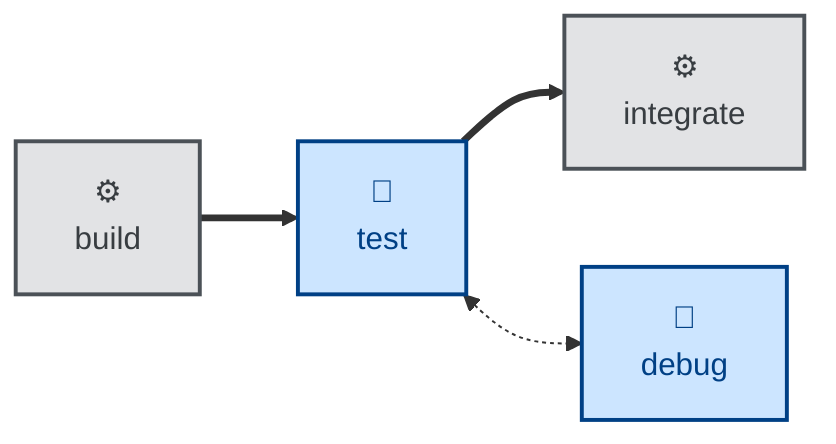

# Test skill

The `test` skill is all about **acceptance verification**. It verifies the whole
solution against the specification — it does not write fresh tests for new
behavior (that's the implementation's job) or diagnose a failure (that's
separate).

It runs the automated suite, covers non-automatable ACs by hand with captured
evidence, and verifies NFRs against their stated thresholds (recording the
*measured number*, not just "ok"). The outcome is a verification report mapping
every AC to a status (PASS / FAIL / BLOCKED / N/A) with evidence, and an explicit
verdict.

Use it after a change has cleared review, or before tagging a release. It
verifies against the agreed specification — whether the specification was right
in the first place is [`validate`](../validate/)'s job. It classifies each
failure as an implementation defect or a specification defect and reports it
without fixing, handing genuine bugs to [`debug`](../debug/).

This skill instructs the agent to run non-interactively, and tests **against the
specification, not the implementation**. It never silently weakens an AC,
downgrades a BLOCKED to PASS, or retries a flaky test until green.

## How to invoke

- `/test`, `/skill:test` (prompts vary by harness).
- "Test this against the spec."
- "Verify this meets the acceptance criteria."
- "Run acceptance testing on this change."

## Recommended models

Mapping acceptance criteria to evidence and classifying pass/fail/blocked is
careful, structured verification work. A mid-tier model is generally sufficient;
escalate to a frontier reasoning model when acceptance criteria are
non-functional and require judgment about whether observed behavior actually
satisfies intent.

## Suggested workflows

`test` runs the built solution against its acceptance criteria before it can
integrate; a failure hands off to [`debug`](../debug/), and only a clean pass
proceeds.
