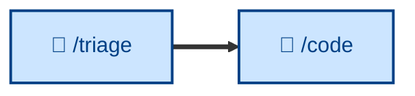
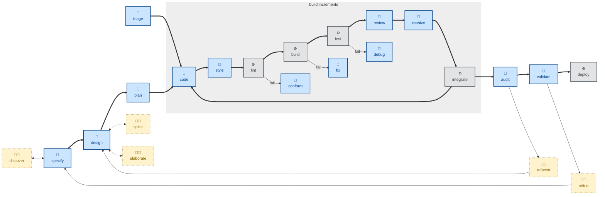

# 🤖 `triage`

`triage` = bug and incident verification. It takes a freshly-filed issue and
decides what happens next: implement, defer, reject, or get more information. It
moves issues through a state machine of category and state labels — gathering
context from the thread and code, reproducing bugs before anything else,
grilling under-specified issues into shape, and applying the outcome (an agent
brief, a needs-info request, or a durably-captured wontfix rationale).

Use it as the reactive entry point to the workflow, to work the incoming queue
or prep issues for agents, before the build loop sets about resolving the issue.
It assumes an issue tracker with category/state labels (and sets up the
vocabulary if missing).

It runs non-interactively but **recommends rather than decides**: triage is the
maintainer's call, so it does the legwork and waits for direction before
applying labels or closing. AI-generated comments are marked with a disclaimer
(🤖).

This skill instructs the agent to run non-interactively (🤖).

> **Note:** the description above reflects the skill's intended narrowed scope
(bugs and incidents only). The current `SKILL.md` additionally classifies
enhancements and routes issues through a label state machine. It will be brought
into line when the skill itself is updated.

## How to invoke

- `/triage`, `/skill:triage` (prompts vary by harness).
- "Triage this issue."
- "Work the incoming issue queue."
- "Prep this issue for an agent."

## Recommended models

Classifying issues and moving them through a state machine is largely
rule-based, so a mid-tier model is sufficient for most of the workflow. A
frontier model helps when reproducing an ambiguous bug report or judging whether
an issue needs to be "grilled into shape" before it's ready for an agent.

## References

- [Original source — mattpocock/skills
  `triage`](https://github.com/mattpocock/skills/blob/main/skills/engineering/triage/SKILL.md):
  The skill this one is adapted from, including the agent-brief and out-of-scope
  conventions.
