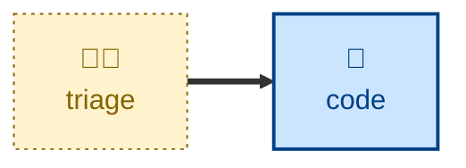

# Triage

Verify that a reported bug or enhancement request is real, reproducible, and
well specified — then recommend how it should be classified and progressed.

The agent takes a single issue from the project's tracker, reads the whole
thread, explores the code it touches, and tries to reproduce any reported bug.
It then proposes a category label and a state label, drawn from the
vocabulary the project actually uses, and — once the maintainer agrees — posts
the accompanying comment and applies the labels.

The agent is instructed to _recommend_ rather than _decide_. A human makes the
final call before an issue is handed to a person or an agent to work on. The
agent is also instructed to stop at classification: it does not write the fix,
nor the specification the fix works from.

## Interactivity

This skill is interactive, and cannot be run away from the keyboard.

The agent pauses for a human decision at the point of classification, and
prompts for anything it cannot discover on its own: which issue to work on,
which tracker the project uses, what its label vocabulary is, and where the
project records ideas it has rejected.

## How to invoke

> Triage this issue.

> Work the incoming issue queue.

> Prep this issue for an agent.

Name the issue in the prompt — a URL, or an ID like `#42` — to skip the
queue-selection step. Name the target state ("this one's a wontfix") to steer
the recommendation, though the agent will still say so if it disagrees.

## Recommended models

A mid-tier model is sufficient for this task. A frontier model will help with
the more ambiguous bug reports, where reproducing the fault means reasoning
about unfamiliar code from a thin description.

## Suggested workflows

Run this on incoming issues, in batches, rather than on every filing as it
arrives. Triage is cheapest when the maintainer is already in the queue.

## Related skills

- [**code**](../code/) \
  Picks up the agent brief this skill produces, and drives the build loop
  from it.

## References

- This skill is adapted from
  [Matt Pocock's `triage` skill](https://github.com/mattpocock/skills/blob/main/skills/engineering/triage/SKILL.md).
