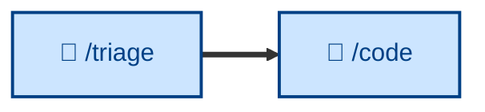

# 🤖 `/triage`

Verify a reported bug or incident is real and reproducible. The reactive entry point to the workflow: it confirms the issue exists before the build loop sets about resolving it. Runs non-interactively (🤖).



> **Note:** the description above reflects the skill's intended narrowed scope (bugs and incidents only). The *What it does* and *Examples* sections below still describe the current `SKILL.md`, which additionally classifies enhancements and routes issues through a label state machine. They will be brought into line when the skill itself is updated.

## What it does

`/triage` takes a freshly-filed issue and decides what happens next: implement, defer, reject, or get more information. It works a defined state machine over two category labels (`bug`, `enhancement`) and five state labels (`needs-triage`, `needs-info`, `ready-for-agent`, `ready-for-human`, `wontfix`), with every triaged issue carrying exactly one of each. It surfaces the issues needing attention (unlabeled, in-triage, or `needs-info` with new replies), gathers context (reading the full thread and prior triage notes so it doesn't re-ask resolved questions, and exploring the relevant code), reproduces bugs before anything else (a confirmed repro is the gold standard), grills under-specified issues into shape, and applies the outcome – posting an agent brief, a needs-info request, or capturing a wontfix rationale durably in `docs/out-of-scope/`.

It is non-interactive but **recommends rather than decides**: triage is the maintainer's call, so it does the legwork and waits for direction before applying labels or closing. AI-generated comments are marked with a disclaimer.

## How to invoke

```
/triage
```

Invoke it to work the incoming queue or prep issues for agents. It assumes an issue tracker with category/state labels (and sets up the vocabulary if missing). It presents the queue and recommendations; the maintainer picks and confirms.

## Examples

For a pool-exhaustion bug, `/triage` reproduces it locally, finds the real issue is a `500` where a `503` is expected, and recommends `ready-for-agent` – posting an agent brief with the problem statement, reproduction command, acceptance criteria, likely files, and explicit out-of-scope items, prefixed with the AI disclaimer.

For an enhancement the maintainer declines, it writes the rationale to `docs/out-of-scope/bulk-import-via-csv.md` and links it from a polite closing comment, so the next person to file the same idea gets a reasoned reply by reference rather than re-litigation.
