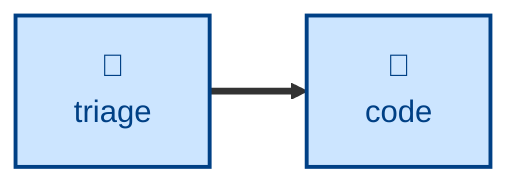

# Triage

The **triage** skill is all about verifying that a reported bug or incident is
real and reproducible.

The agent is instructed to take a freshly-filed issue and decides what happens
next. The agent gathers context from the thread and code, tries to reproduce
the reported bugs, and updates the issue with its findings and recommended
remedies.

The agent is explicitly instructed to _recommend_ rather than _decide_. Humans
are expected to make a final call before assigning an issue to a person or
agent to work on.

## Interactivity

This skill is interactive.

## How to invoke

> Triage this issue.

> Work the incoming issue queue.

> Prep this issue for an agent.

## Recommended models

A mid-tier model is sufficient for this task. A frontier model will help
with the more ambiguous bug reports.

## Suggested workflows

## Related skills

- **[code](../code/)** picks up the agent brief this skill produces to drive the build loop.

## References

- This skill is adapted from
  [Matt Pocock's `triage` skill](https://github.com/mattpocock/skills/blob/main/skills/engineering/triage/SKILL.md).
