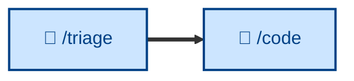

# 🤖 `/triage`

Verify a reported bug or incident is real and reproducible. The reactive entry point to the workflow: it confirms the issue exists before the build loop sets about resolving it. Runs non-interactively (🤖).

> **Note:** the description above reflects the skill's intended narrowed scope (bugs and incidents only). The *What it does* and *Examples* sections below still describe the current `SKILL.md`, which additionally classifies enhancements and routes issues through a label state machine. They will be brought into line when the skill itself is updated.

## What it does

`/triage` takes a freshly-filed issue and decides what happens next: implement, defer, reject, or get more information. It moves issues through a state machine of category and state labels – gathering context from the thread and code, reproducing bugs before anything else, grilling under-specified issues into shape, and applying the outcome (an agent brief, a needs-info request, or a durably-captured wontfix rationale).

It is non-interactive but **recommends rather than decides**: triage is the maintainer's call, so it does the legwork and waits for direction before applying labels or closing. AI-generated comments are marked with a disclaimer.

## How to invoke

Invoke it to work the incoming queue or prep issues for agents. It assumes an issue tracker with category/state labels (and sets up the vocabulary if missing).

- `/triage`, `/skill:triage` (prompt varies by agent harness).
- "Triage this issue."
- "Work the incoming issue queue."
- "Prep this issue for an agent."

## References

- [Original source – mattpocock/skills `triage`](https://github.com/mattpocock/skills/blob/main/skills/engineering/triage/SKILL.md): The skill this one is adapted from, including the agent-brief and out-of-scope conventions.
