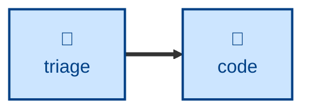

# Triage

The **triage** skill is all about verifying that a reported bug or incident is
real and reproducible. It takes a
freshly-filed issue and decides what happens next: implement, defer, reject, or
get more information.

It moves issues through a state machine of category and state labels — gathering
context from the thread and code, reproducing bugs before anything else, grilling
under-specified issues into shape, and applying the outcome (an agent brief, a
needs-info request, or a durably-captured wontfix rationale).

Use it as the reactive entry point to the workflow — to work the incoming queue
or prep issues for agents — before the build loop sets about resolving the issue.
It assumes an issue tracker with category/state labels (and sets up the
vocabulary if missing).

It **recommends rather than decides:** triage is the maintainer's call, so it
does the legwork and waits for direction before applying labels or closing.
AI-generated comments are marked with a disclaimer.

## Interactivity

This skill is interactive. Triage is a maintainer's decision: the agent
presents its recommendation and waits for direction before applying labels,
posting comments, or closing anything. It also prompts to establish the
tracker, the label vocabulary, and the out-of-scope record when context and
environment do not settle them.

## How to invoke

> Triage this issue.

> Work the incoming issue queue.

> Prep this issue for an agent.

## Recommended models

A mid-tier model is sufficient for most of this task. A frontier model helps
with ambiguous bug reports.

## Suggested workflows

**triage** is the reactive entry point to the workflow: a triaged, reproduced
issue becomes an agent brief that **[code](../code/)** picks up to drive the build
loop.

> **Note:** the description above reflects the skill's intended narrowed scope
> (bugs and incidents only). The current `SKILL.md` additionally classifies
> enhancements and routes issues through a label state machine. It will be
> brought into line when the skill itself is updated.

## Related skills

- **[code](../code/):** picks up the agent brief this skill produces to drive
  the build loop.

## References

- [Original source — mattpocock/skills
  **triage**](https://github.com/mattpocock/skills/blob/main/skills/engineering/triage/SKILL.md):
  The skill this one is adapted from, including the agent-brief and out-of-scope
  conventions.
