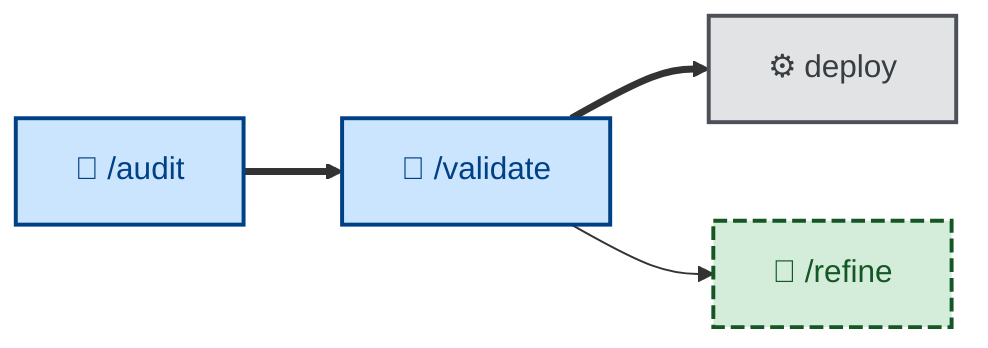

# 🤖 `validate`

`validate` = product fitness review. Once all of a plan's increments are built,
reviewed, and tested, it steps back and checks the working software against the
need it was meant to serve — recovered from the preserved PRD or the
specification's outcome and success measures. It walks the software as the user
pursuing their real goal, not scenario by scenario, and surfaces the gaps where
what was *specified* diverged from what was *wanted*. A change can pass every
acceptance criterion in `test` and still fail `validate` — it does exactly what
was specified, and what was specified wasn't what the user needed. That gap is
the point of the skill.

Use it once a plan's increments are all complete and have cleared
[`test`](../test/). It evaluates the whole completed body of work, so it takes
no per-increment argument.

It is the companion to [`test`](../test/): where `test` asks "did we build it
right?", `validate` asks "did we build the right thing?"

It runs non-interactively and is **evaluation only**: it outputs a bounded,
prioritized report and an explicit verdict (meets the need / gaps found), but
changes no specification and no code. Acting on a suggestion is
[`refine`](../refine/)'s job, which flows into [`specify`](../specify/). The
loop is `validate → refine → specify` (🤖).

This skill instructs the agent to run non-interactively (🤖).

## How to invoke

- `/validate`, `/skill:validate` (prompts vary by harness).
- "Validate this against what the user actually needed."
- "Did we build the right thing?"
- "Check the working software against the original goal."

## Recommended models

Judging whether completed work actually meets the user's real need — as opposed
to the letter of the acceptance criteria — is a subjective, high-stakes call.
Use a frontier reasoning model; this skill exists precisely to catch the gap
between "met the spec" and "solved the problem," which requires stepping outside
the documented requirements.
