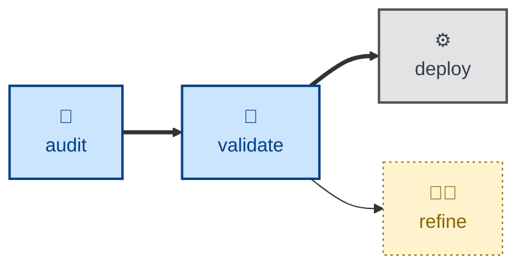

# Validate

The **validate** skill is all about asking, "did we build the right thing?"

The agent is instructed to recover the originating statement of need, walk
through the working software as the user pursuing their goal, and surface the
gaps where what was _specified_ has diverged from what the user actually
wanted. Each gap is classified, evidenced, and priced, and the whole set is
bounded to the five to ten findings that matter most.

This is evaluation only. The agent produces a prioritized report and an
explicit verdict — MEETS THE NEED or GAPS FOUND — but changes no
specification and no code.

Note the distinction from verification: checking the code against its
acceptance criteria is a different job. Validation questions the acceptance
criteria themselves.

## Interactivity

This skill instructs the agent to run non-interactively. It resolves the
specification, the statement of need, and the running software from context
and the environment, and stops with an error rather than prompting the user.
It is therefore safe in away-from-keyboard and continuous integration
workflows.

## How to invoke

> Did we build the right thing?

> Does the software fulfill its goals?

> What gaps can you find in the requirements specification?

## Recommended models

A premium frontier reasoning model. The task is open-ended judgment — inferring
unstated user needs, weighing impact against change cost, and resisting the
pull toward manufacturing findings — none of which a small model does reliably.

## Suggested workflows

Run this once a body of work is complete and demonstrable, not on every
commit. Validation needs working software to walk through, and its output is
an input to the next round of requirements refinement.

## Related skills

- [**refine**](../refine/) \
  Acts on the specification gaps this skill surfaces, turning suggested
  directions into revised requirements.

- [**audit**](../audit/) \
  Checks the architectural integrity of the evolving system, where this skill
  checks its fitness for the user's need.

- [**test**](../test/) \
  Verifies the system against its specification, where this skill questions
  whether that specification was right.
