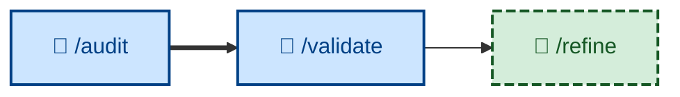

# 🤖 `/validate`

<!-- This is an evaluation step, except it evaluates if the specifications were correct in the first place, by revealing user assumptions through testing of working software. Is the user's _actual_ need different from what we thought it was? -->

<!-- Analogous to /audit, which evaluates the evolving architecture, rather than behaviors. -->

<!-- both /audit and /validate hang off the end of the build loop – once an increment is built, reviewed, and tested, you step back and evaluate at the two higher levels (design fitness, product fitness) -->

<!-- /validate feeds into /refine. While /validate does the actual evaluation of the evolving product, /refine is responsible for putting the findings into action. /refine is analogous to /refactor, which serves the equivalent role in the design feedback loop. -->

Evaluate the correctness and completeness of the requirements by testing the current implementation – judging completed, tested work against the users' *actual needs*, not just the agreed acceptance criteria, to decide whether the specification itself should evolve. Runs non-interactively (🤖). The product-level counterpart to [`/test`](../test/): where `/test` asks "did we build it right?", `/validate` asks "did we build the right thing?"

## What it does

Once all of a plan's increments are built, reviewed, and tested, `/validate` steps back and checks the working software against the need it was meant to serve – recovered from the preserved PRD or the specification's outcome and success measures. It walks the software as the user pursuing their real goal, not scenario by scenario, and surfaces the gaps where what was *specified* diverged from what was *wanted*.

A change can pass every acceptance criterion in `/test` and still fail `/validate` – it does exactly what was specified, and what was specified wasn't what the user needed. That gap is the point of the skill.

It runs non-interactively and is **evaluation only**: it outputs a bounded, prioritized report and an explicit verdict (meets the need / gaps found), but changes no specification and no code. Acting on a suggestion is [`/refine`](../refine/)'s job, which flows into [`/specify`](../specify/). The loop is `validate → refine → specify`.

## How to invoke

Invoke it once a plan's increments are all complete and have cleared [`/test`](../test/). It evaluates the whole completed body of work, so it takes no per-increment argument.

- `/validate`, `/skill:validate` (prompt varies by agent harness).
- "Validate this against what the user actually needed."
- "Did we build the right thing?"
- "Check the working software against the original goal."
