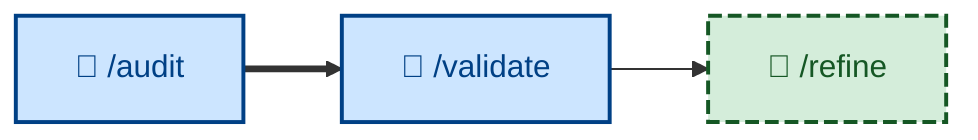

# 🤖 `/validate`

Evaluate the correctness and completeness of the requirements by testing the current implementation – judging completed, tested work against the users' *actual needs*, not just the agreed acceptance criteria, to decide whether the specification itself should evolve. Runs non-interactively (🤖). The product-level counterpart to [`/test`](../test/): where `/test` asks "did we build it right?", `/validate` asks "did we build the right thing?"



## What it does

Once all of a plan's increments are built, reviewed, and tested, `/validate` steps back and checks the working software against the need it was meant to serve – recovered from the preserved PRD, the specification's outcome and success measures, or the discovery report. It walks the software as the user pursuing their real goal, not scenario by scenario, and surfaces the gaps where what was *specified* diverged from what was *wanted*: unmet needs, wrong targets, missing requirements, over-specification, stale assumptions.

A change can pass every acceptance criterion in `/test` and still fail `/validate` – it does exactly what was specified, and what was specified wasn't what the user needed. That gap is the point of the skill.

It runs non-interactively and is **evaluation only**: it outputs a bounded, prioritized report of suggestions and an explicit verdict (meets the need / gaps found), but changes no specification and no code. Acting on a suggestion is [`/refine`](../refine/)'s job, which flows into [`/specify`](../specify/). The loop is `validate → refine → specify`.

## How to invoke

Invoke `/validate` once a plan's increments are all complete and have cleared [`/test`](../test/):

```
/validate
```

It needs the working software and the originating statement of need (the preserved PRD, the specification's outcome/success measures, or the discovery report). It evaluates the whole completed body of work, so it takes no per-increment argument.

## Examples

Given a checkout flow whose every AC passes, `/validate` recovers the success measure from the PRD ("a returning customer completes checkout in under 30 seconds"), walks the flow as that customer, and finds they must re-enter their saved address at step 4 – a step the ACs never forbade but the need implies they should never hit. It reports `GAPS FOUND`, classifies it as an *unmet need*, cites the flow step as evidence, and suggests the direction for [`/refine`](../refine/) to draft: "saved addresses are pre-filled and editable, never re-entered."

Where the working software genuinely serves the need, `/validate` reports `MEETS THE NEED` and recommends no specification change – it is not obliged to manufacture findings.
