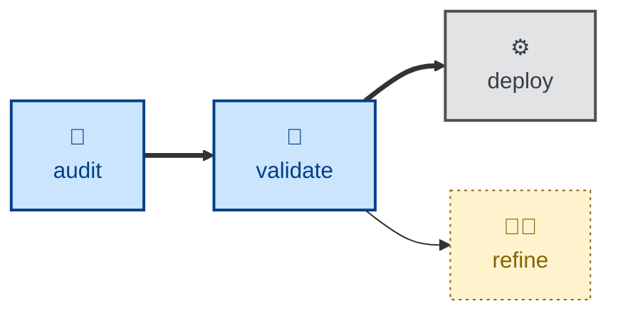

# Validate

The **validate** skill is all about asking, "did we build the right thing?"

The agent is instructed to walk through the software as the user in pursuit of
their goals, and to surface gaps where what was _specified_ may have diverged
from what the user might actually _want_.

This skill i evaluation only. The agent outputs a bounded, prioritized report
and an explicit verdict, but changes no specification and no code.

## Interactivity

This skill instructs the agent to run non-interactively.

## How to invoke

> Did we build the right thing?

> Does the software fulfill its goals?

> What gaps can you find in the requirements specification?

## Recommended models

A frontier reasoning model is best suited to this task.

## Suggested workflows

## Related skills

- **[refine](../refine/)** may be used to act on the gaps this skill surfaces.

- **[audit](../audit/)** checks the architectural integrity of the evolving system.

- **[test](../test/)** verifies the system against its specification.
